## Evolutionary Approach to PID Tuning
##### Applied to a Mass-Spring-Damper system

---

## Mass Spring Damper System

The goal is to model a dynamical system and evolve the PID gains to control the system.


+++

## Model


`f(t) = m x''(t) + c mx'(t) + kx(t)`

`P(s) = F(s)/X(s) = 1 / (ms^2 + cs + k )`

`m = 1kg, c = 10 Ns/m, k = 20 N/m`


+++

## Controller


`u(t) = Kp * e(t) + Ki \int e(t)dt + Kp de(t)/dt`

`C(s) = Kp + 1/s  Ki + s Kd`


+++

## Simulation Engine

MATLAB can be used to model the system and its response.

```c
function resp = pid_step(Kp, Ki, Kd, u, t)

s = tf('s');
G = 1/(s^2 + 10*s + 20);

C = pid(Kp,Ki,Kd);
T = feedback(C*G,1);

[y, t] = lsim(T, u, t);
resp = [y, t];

```

---

## Design & Implementation

* search space and representation
* the objective function
* the variation operator
* the recombination method
* the selection method


---

## Search Space

- `Ki , Kp, and Kd`

- Real numbers with upper and lower limits

---

## Objective Function

- `ISE = \int_0^\inf [e(t)]^2 dt`
- `IAE = \int_0^\inf |e(t)| dt`
- `IAE = \int_0^\inf t|e(t)| dt`

The fitness of a gene can then be calculated as

`J = w1 * ISE + w2 * IAE + w3 * ITAE `, where `\Sum_{i=1}^3 wi = 1`.

+++

## Matlab Engine

```python

import matlab.engine

def matlab_init(n):
    """ initialize n matlab engines
    """
    engines = {}
    for key in range(n):
        engines[key] = matlab.engine.start_matlab()

    return engines

def matlab_sim(eng, pop, u, t):
    """
    Run the simulation in matlab using the controller
    constants in each gene and the given 'input' series [r,t]
    and return simulation output as [y, t].

    Then return input an output for each simulations in array [r,y,t] for each
    index.
    """

    #convert float to matlab double
    pop_mat = matlab.double(pop.tolist())
    u_mat = matlab.double(u.tolist())
    t_mat = matlab.double(t.tolist())

    #placeholder for simulation output: idx,
    simout = np.zeros((len(pop[:,0]), len(t), 3))

    for i in range(len(pop[:,0])):
        #i = int(idx)
        output = eng.pid_step(pop_mat[i][1], pop_mat[i][2], pop_mat[i][3], u_mat, t_mat)
        #output = eng.pid_step(Kp, Ki, Kd, u, t)

        #print "idx: ", i
        #print output
        u = np.asarray(u).reshape(len(t), 1)
        t = np.asarray(t).reshape(len(t), 1)
        out = np.asarray(output)[:,0].reshape(len(t), 1)
        simout[i] = np.concatenate((out, u, t), axis = 1)

    return simout
```

+++

## Fitness Calculation

```python
def ise_calc(simout):
    """
    Calculates the integral squared error of the timeseries
    output y with respect to the desired input u and delta t.

    ISE = sum ((y - u)^2 * delta t )
    """
    u = simout[:, 0]
    y = simout[:, 1]
    t = simout[:, 2]
    ise = 0
    for i in range(1, len(t)-1):
        ise += (y[i] - u[i])**2 * (t[i]-t[i-1])

    return ise

def iae_calc(simout):
    """
    Calculates the integral absolute error of the timeseries
    output y with respect to the desired input u and delta t.

    u -> simout[:, 0]
    y -> simout[:, 1]
    t -> simput[:, 2]

    IAE = sum (abs(y - r) * delta t )
    """

    u = simout[:, 0]
    y = simout[:, 1]
    t = simout[:, 2]
    iae = 0
    for i in range(1, len(t)-1):
        iae += abs(y[i] - u[i]) * (t[i]-t[i-1])

    return iae

def itae_calc(simout):
    """
    Calculates the integrated time absolute error of the timeseries
    output y with respect to the desired input r and delta t.

    ITAE = sum (t * abs(y - u) * delta t )
    """
    u = simout[:, 0]
    y = simout[:, 1]
    t = simout[:, 2]

    itae = 0
    for i in range(1, len(t)-1):
        itae += t[i] * abs(y[i] - u[i]) * (t[i]-t[i-1])

    return itae

  def fitness(pop, simout, weights):
      """
      calculate the fitness for each gene in the population
      based on the objective functions:

      J = w1 * ISE + w2 * IAE + w3 * itae,
      where sum of w_i = 1

      Returns the fitness of each gene in nx2 matrix [idx, J]
      """
      psize = len(pop[:,0])
      J = np.concatenate((pop[:,0].reshape(psize,1), np.zeros((psize,1))), axis = 1)
      for i in range(len(pop[:,0])):
          J[i, 1] = weights[0] * ise_calc(simout[i, :, :]) + weights[1] * iae_calc(simout[i, :, :]) + weights[2] * itae_calc(simout[i, :, :])

      return J
```

---

## Recombination, Mutation, Selection

* Recombination: single crossover point
* Mutation: Gaussian mutator
* Selection: Truncation or fitness proportional

+++

## Recombination
```python

def recombine(pop, recomb_rate):
    """
    Recombination of parent population to create
    same number of offsprings as there are parents.
    """
    psize = len(pop[:,0])
    idx = np.arange(psize).reshape(psize, 1)
    offspring = np.concatenate((idx, np.zeros((psize, 3))), axis = 1)

    for i in range(psize):
        if float(np.random.random(1) < recomb_rate):
            offspring[i] = pop[i]
        else :
            parent1 = pop[i]
            #print 'parent1: ', parent1
            parent2 = pop[np.random.randint(0, psize)]
            #print 'parent2: ', parent2
            XO_pt = np.random.randint(1, 3)
            for j in range(1, 4):
                #print 'xo-pt / j: ', XO_pt, j
                offspring[i,j] = parent1[j] if j<= XO_pt else parent2[j]
            #print 'offspring: ', offspring[i]

    return offspring
```


+++
## Mutation

```python

def mutate(pop, mut_rate, oper, step, min_k, max_k):
    """
    Given a population, mutate each genotype stochastically using a
    "gaussian" operator
    "cauchy" operator  --- not yet
    """

    for i in range(len(pop[:,0])):
        for j in range(1,4):
            if float(np.random.random(1)) >= mut_rate:
                if oper == "gaussian" :
                    pop[i,j] += np.random.normal(0, step/math.sqrt(2.0/math.pi))
                elif oper == "cauchy" :
                    pop[i,j] += float(np.random.standard_cauchy(1))

            if pop[i,j] > max_k:
                pop[i,j] = max_k
            elif pop[i,j] < min_k:
                pop[i,j] = min_k

    return pop
```
+++

## Selection

```python
def select(parent, Jparent, children, Jchildren, iter):
    """

    select the fittest population from the parent and offspring
    """

    psize = len(parent[:,0])
    idx = np.arange(psize).reshape(psize, 1)
    selection = np.concatenate((idx, np.zeros((psize, 3))), axis = 1)
    #selection = np.empty([psize, 4])

    CDF = np.empty([2*psize,1])
    sampleP = np.empty([2*psize,1])

    # all genomes, delete index
    totalPop = np.delete(np.vstack((parent, children)), 0, axis=1)

    # all objective function
    totalJ = np.vstack((Jparent, Jchildren))
    genomes = np.concatenate((totalJ, totalPop), axis =1 )
    genomes = genomes[genomes[:,1].argsort()] # sort by fitness

    #truncation
    for i in range(psize):
        selection[i][1:4] = genomes[i][2:5]

    #proportional
    '''
    cumJ = np.sum(genomes[:,1])
    for i in range(2*psize):
        sampleP[i] = genomes[i,1] / cumJ
        CDF[i] = sampleP[i] if i == 0 else (CDF[i-1]+sampleP[i])

    for i in range(psize):
        for k in range(2*psize):
            if float(np.random.random(1)) > CDF[k]:
                selection[i][1:4] = genomes[k][2:5]
                break

    '''
    return selection
```
---

## Running the Algorithm

```python
def run_EV():
    """ runs the ev and plots fitness at each run ...
        optionally set debug = true and print the
        population after each mutation
    """

    #initial population
    genes = 20           # 5 parents
    seed = 1023      #np.random.randint(1,1000)     # random number seed
    factor = 10       # initial guess spread
    max_iter = 20      # max iterations

    #time
    sigType = 4         # 1 - unit step, 2 - step with A=15, 3- square wave, 4 - square wave
    simT = 12           # simulation time
    simDT = 0.01        # simulation time step
    min_k = 0           # control gain lower limit
    max_k = 400         # control gain upper limit

    # weights
    weights = [0.4, 0.3, 0.3]    # ise, iae, itae

    # variation operators
    recomb_rate = 0.5
    mut_rate = 0.3
    mut_oper = "gaussian"
    mut_step = 30
    alpha = 0.98

    # init matlab connection, just one until parallelized
    eng = matlab_init(1)
    #print eng[0]

    # init population, 5 genes, seed = 20, factor 10
    pop = population_init(genes, seed, factor)


    # let's simulate our controller-plant system
    # using step input, t:=5s, dt:=0.1
    (u,t) = matlab_gensig(sigType, simT, simDT)
    simout = matlab_sim(eng[0], pop, u, t)
    simout_init = simout
    #calc fitness
    Jp = fitness(pop, simout, weights)

    print 'Initial: ', pop
    print 'Initial J :', Jp

    #average fitness
    iter = 0
    Jave = np.empty((max_iter+1, 2))
    Jave[:,0] = np.arange(max_iter+1)
    Jave[0, 1] = np.mean(Jp[:,1])

    while (iter < max_iter):
        mut_step = alpha * mut_step

        iter += 1
        print "-----------------------------------------"
        print "ITERATION: ", iter

        # create new gerenation
        offspring = recombine(pop, recomb_rate)
        offspring = mutate(offspring, mut_rate, mut_oper, mut_step, min_k, max_k)
        #print 'offspring: ', offspring

        simout = matlab_sim(eng[0], offspring, u, t)
        Jc = fitness(pop, simout, weights)
        #print 'Jc: ', Jc

        pop_new = select(pop, Jp, offspring, Jc, iter)

        simout = matlab_sim(eng[0], pop_new, u, t)
        Jp = fitness(pop_new, simout, weights)
        #print 'Selected: ', pop
        #print 'Selected J :', Jp
        Jave[iter, 1] = np.mean(Jp[:,1])
        print np.mean(Jp[:,1])
        #print Jp[:,1]
        pop = pop_new
        if iter == 0.5*max_iter:
            simout_mid = simout

    plot_simout(simout_init, simout_mid, simout, "sim_results/simout.png")
    plot_aveFitness(Jave, "sim_results/objective.png")
    print 'Fintal pop: ', pop
    print 'Final J: ', Jp
    print 'Jave: ', Jave
    #print 'simout: ' , simout
    print 'simout: ' , simout[0][:][:]
```

---

## Results - 1

**Table 1:** Varying the number of genes and spread factor with 20 iterations.

| Seed   | # of Genes | Spread  |
| ------ |:----------:| -------:|
| 1023   | 5          |   10    |
| 1023   | 10         |   10    |
| 1023   | 20         |   10    |
| 1023   | 10         |   100   |

+++

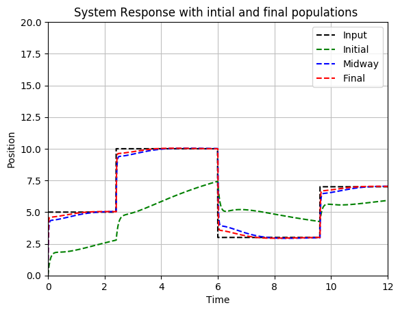

**Figure 3:** Seed: 1023, Genes:	5, Spread: 10
+++

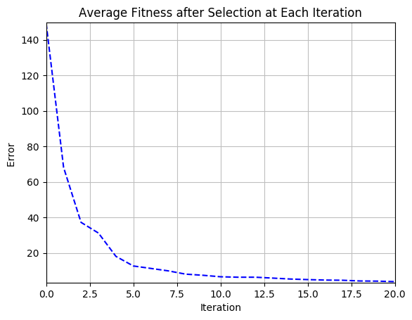

**Figure 3:** Seed: 1023, Genes:	5, Spread: 10

+++

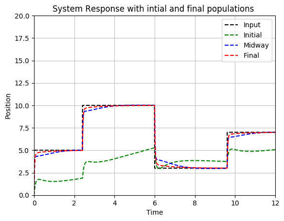

**Figure 4:** Seed: 1023, Genes:	10, Spread: 10

+++


**Figure 4:** Seed: 1023, Genes:	10, Spread: 10

+++

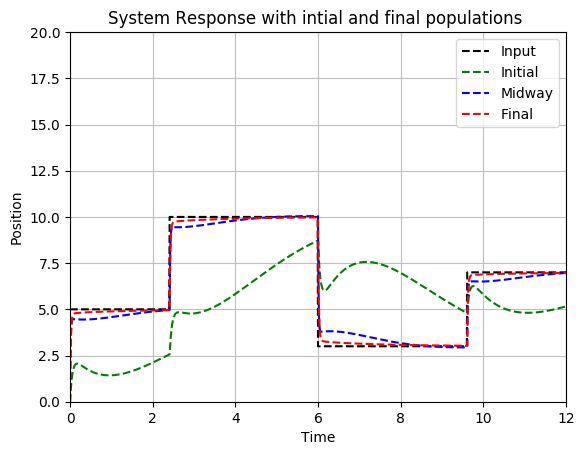

**Figure 5:** Seed: 1023, Genes:	20, Spread: 10
+++

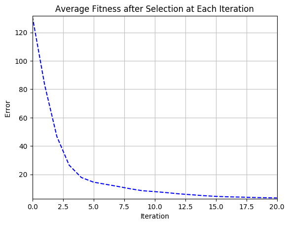

**Figure 5:** Seed: 1023, Genes:	20, Spread: 10

+++

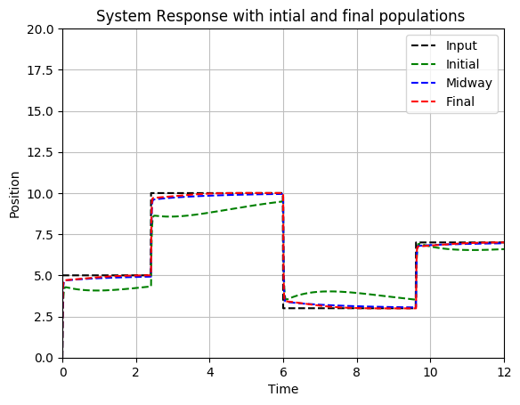

**Figure 6:** Seed: 1023, Genes:	10, Spread: 100

+++

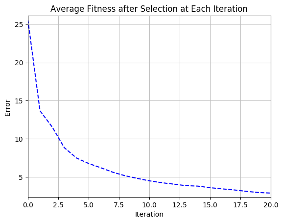

**Figure 6:** Seed: 1023, Genes:	10, Spread: 100


---

## Results - 2

**Table 2:** Varying the Gaussian step size, recomb_rate, and mut_rate

| Step   | Recomb_rate | Mut_rate |
| ------ |:-----------:| ---------:|
| 1      | 0.5         |   0.3    |
| 10     | 0.5         |   0.3    |
| 30     | 0.5         |   0.3   |
| 30     | 0.1         |   0.3   |
| 30     | 0.5         |   0.6   |

+++

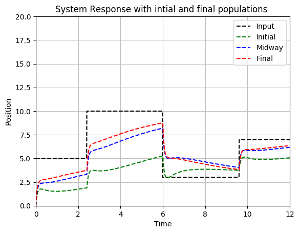

**Figure 7:** Step: 1, Recombination: 0.5, Mutation: 0.3
+++

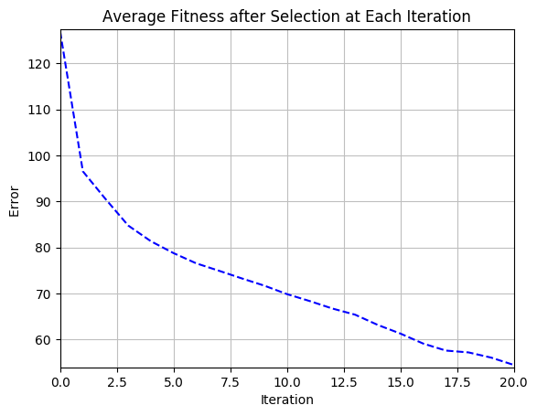

**Figure 7:** Step: 1, Recombination: 0.5, Mutation: 0.3

+++


**Figure 8:** Step: 10, Recombination: 0.5, Mutation: 0.3

+++

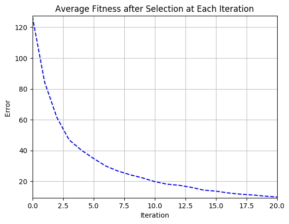

**Figure 8:** Step: 10, Recombination: 0.5, Mutation: 0.3

+++


**Figure 9:** Step: 30, Recombination: 0.5, Mutation: 0.3
+++

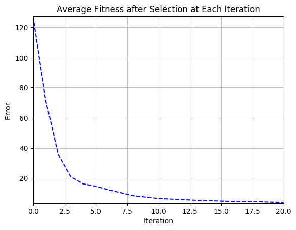

**Figure 9:** Step: 30, Recombination: 0.5, Mutation: 0.3

+++

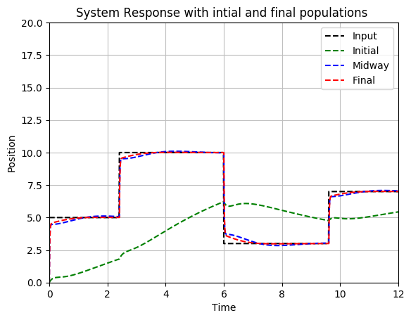

**Figure 10:** Step: 30, Recombination: 0.1, Mutation: 0.3

+++
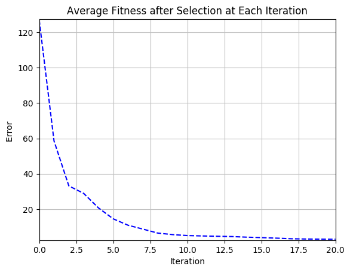

**Figure 10:** Step: 30, Recombination: 0.1, Mutation: 0.3

+++

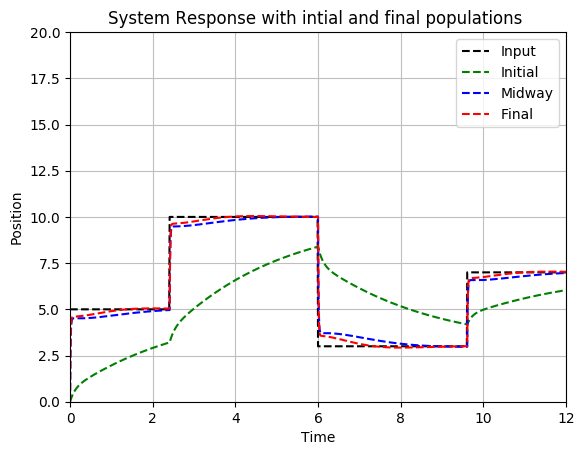

**Figure 11:** Step: 30, Recombination: 0.5, Mutation: 0.6

+++


**Figure 11:** Step: 30, Recombination: 0.5, Mutation: 0.6


---

## Conclusions

- evolutionary approach and implementation is **promising**
- needs more testing for **governing factors**
- apply to problems with **delays** and **unknown dynamics**


#### Source code & report:

[https://github.com/hlmeS/ec/tree/master/pidEV](https://github.com/hlmeS/ec/tree/master/pidEV)

---

## References

[1.] L. Altenberg, "ICS674 - Evolutionary Computation". Class Presentation. 2017.

[2.] K. De Jong. "Evolutionary Computation: a unified approach". MIT Press. 2006

+++

[3.] A. Jayachitra and R. Vinodha, “Genetic Algorithm Based PID Controller Tuning Approach for Continuous Stirred Tank Reactor,” Advances in Artificial Intelligence, vol. 2014, Article ID 791230, 8 pages, 2014. doi:10.1155/2014/791230

+++
[4.] [Introduction: PID Controller Design, Control Tutorial](http://ctms.engin.umich.edu/CTMS/index.php?example=Introduction&section=ControlPID)

[5.] [Extras: Generating a Step Response in MATLAB, Control Tutorial](http://ctms.engin.umich.edu/CTMS/index.php?aux=Extras_step)
