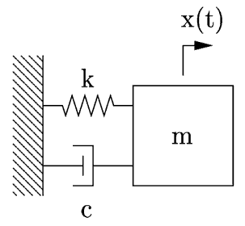
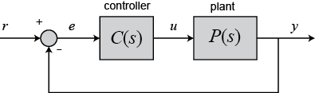

# PID-Tuning using Evolutionary Computation

## Abstract

## Introduction
### Motivation

PID (Proportional, Integral, Derivative) Controllers are a common feedback control method for controlling dynamic systems, given their well-known form, simplicity when compared to modern algorithms, and wide range of applications, i.e. about 90% of the industry still uses PID controllers [3]. Yet, despite its well-known form, the tuning of a PID controller may seem daunting when the behavior of the dynamic system is not known and difficult to estimate, and when external conditions vary from those experienced during the tuning process. A variety of PID-tuning approaches have been proposed and implemented to address these challenges, one being an evolutionary computation approach [3]. This project tests the use of a genetic search algorithm to find optimal PID control gains for a sample mechanical system.

## Problem Definition
In bridging the disciplines of evolutionary computation and control engineering, this project attempts the tuning of a PID-controller (i.e. it's proportional, integral, and derivative gains) for the textbook control system example: a mass-spring-damper system. More specifically, a generic search algorithm is applied in search for an optimal set of control gains using concepts of recombination, mutation, and selection.

## Dynamical System

### Model

The model system chosen is that of a classical mass-spring-damper, as illustrated in Figure 1. A mass of mass _m_ is attached to a wall with a spring with spring constant _m_ and a damper with damping coefficient _c_. A force _F_ is then applied to displace the block in its horizontal position. The dynamics of the system can simply be described in the time domain as `f(t) = m x''(t) + c mx'(t) + k(x) ` or by its transfer function `P(s) = F(s)/X(s) = 1 / (ms^2 + cs + k )`. The variables _m_, _c_, and _k_ were chosen as `1 kg`, `20 Ns/m`, and `10 N/m` respectively.



**Figure 1:** Mass spring damper system.

### PID Controller

In this project, a PID-controller was considered for feedback control system with unary feedback signal shown in Figure 2. The plant model is the aforementioned mass-spring-damper system. The controller can be described as `u(t) = Kp * e(t) + Ki \int e(t)dt + Kp de(t)/dt` in the time domain or as `C(s) = Kp + 1/s  Ki + s Kd` in its trasnfer form [see 4,5].




**Figure 2:** Feedback Control Loop.

### Simulation Engine

The above model and controller were modeled and simulated using the MATLAB script described in Listing 1. The script takes the three control gain, and system inputs _u_ and _t_ as its inputs, then models the plant, _G_, the controller, _C_, and the overall system, _T_, and ultimately simulates and returns the _T_'s response to the input (_u_, _t_), where _t_ is a time series and _u_ the reference point.

**Listing 1:** MATLAB code for model simulation.
``` c
function resp = pid_step(Kp, Ki, Kd, u, t)

s = tf('s');
G = 1/(s^2 + 10*s + 20);

C = pid(Kp,Ki,Kd);
T = feedback(C*G,1);

[y, t] = lsim(T, u, t);
resp = [y, t];
```

## GA Design & Implementation

A genetic search approach was taken to tune the PID control gains of the aforementioned system. The algorithm was broken down by its search space and representation, the objective function, the variation operator, the recombination method, and the selection method. Each aspect of the algorithm is described in the following in terms of design and Python implementation.

### Search Space and Representation
The search space, _S_, is comprised of the three control gain, _Kp_, _Ki_, and _Kd_, each of which can be described as a real number on the interval `I = [lower limit, upper limit]`. As shown in Listing 3, the control gains, _chromosomes_, for each _gene_ in the population of size `size` is drawn at random from a distribution generated with some initial `seed`.  

**Listing 3:** Initialization of the population.
```python
def population_init(size, seed, spread):
    """
    Generates a population as an array
    with Kp, Ki, Kd as the columns and
    'size' number of gene pairs.

    The 'seed' let's us control the seed for random number
    generation.

    The 'spread' let's us scale our random numbers by the
    'spread' factor.
    """

    np.random.seed(seed)
    idx = np.arange(size).reshape(size, 1)
    genes = spread*np.random.random((size, 3))
    genes = np.concatenate((idx, genes), axis = 1)
    return genes

```

### Objective function

The fitness of a gene is measured by the weighted sum of the integral squared error (ISE), integral absolute error (IAE), and integrated time absolute error (ITAE) for the system response, using the following equations:

- `ISE = \int_0^\inf [e(t)]^2 dt`
- `IAE = \int_0^\inf |e(t)| dt`
- `IAE = \int_0^\inf t|e(t)| dt`

The fitness of a gene can then be calculated as

`J = w1 ISE + w2 * IAE + w3 * ITAE `, where `\Sum_{i=1}^3 wi = 1`.


The [MATLAB Engine API for Python](https://www.mathworks.com/help/matlab/matlab-engine-for-python.html?nocookie=true) was used to call the MATLAB script from within python, as shown in Listing 4 below. The error and fitness calculation can be seen in Listing 5.

**Listing 4:** Reference for using the MATLAB Engine API in Python

```python

import matlab.engine

def matlab_init(n):
    """ initialize n matlab engines
    """
    engines = {}
    for key in range(n):
        engines[key] = matlab.engine.start_matlab()

    return engines

def matlab_sim(eng, pop, u, t):
    """
    Run the simulation in matlab using the controller
    constants in each gene and the given 'input' series [r,t]
    and return simulation output as [y, t].

    Then return input an output for each simulations in array [r,y,t] for each
    index.
    """

    #convert float to matlab double
    pop_mat = matlab.double(pop.tolist())
    u_mat = matlab.double(u.tolist())
    t_mat = matlab.double(t.tolist())

    #placeholder for simulation output: idx,
    simout = np.zeros((len(pop[:,0]), len(t), 3))

    for i in range(len(pop[:,0])):
        #i = int(idx)
        output = eng.pid_step(pop_mat[i][1], pop_mat[i][2], pop_mat[i][3], u_mat, t_mat)
        #output = eng.pid_step(Kp, Ki, Kd, u, t)

        #print "idx: ", i
        #print output
        u = np.asarray(u).reshape(len(t), 1)
        t = np.asarray(t).reshape(len(t), 1)
        out = np.asarray(output)[:,0].reshape(len(t), 1)
        simout[i] = np.concatenate((out, u, t), axis = 1)

    return simout
```

**Listing 5:** Error and fitness calculation in Python.
```python
def ise_calc(simout):
    """
    Calculates the integral squared error of the timeseries
    output y with respect to the desired input u and delta t.

    ISE = sum ((y - u)^2 * delta t )
    """
    u = simout[:, 0]
    y = simout[:, 1]
    t = simout[:, 2]
    ise = 0
    for i in range(1, len(t)-1):
        ise += (y[i] - u[i])**2 * (t[i]-t[i-1])

    return ise

def iae_calc(simout):
    """
    Calculates the integral absolute error of the timeseries
    output y with respect to the desired input u and delta t.

    u -> simout[:, 0]
    y -> simout[:, 1]
    t -> simput[:, 2]

    IAE = sum (abs(y - r) * delta t )
    """

    u = simout[:, 0]
    y = simout[:, 1]
    t = simout[:, 2]
    iae = 0
    for i in range(1, len(t)-1):
        iae += abs(y[i] - u[i]) * (t[i]-t[i-1])

    return iae

def itae_calc(simout):
    """
    Calculates the integrated time absolute error of the timeseries
    output y with respect to the desired input r and delta t.

    ITAE = sum (t * abs(y - u) * delta t )
    """
    u = simout[:, 0]
    y = simout[:, 1]
    t = simout[:, 2]

    itae = 0
    for i in range(1, len(t)-1):
        itae += t[i] * abs(y[i] - u[i]) * (t[i]-t[i-1])

    return itae

  def fitness(pop, simout, weights):
      """
      calculate the fitness for each gene in the population
      based on the objective functions:

      J = w1 * ISE + w2 * IAE + w3 * itae,
      where sum of w_i = 1

      Returns the fitness of each gene in nx2 matrix [idx, J]
      """
      psize = len(pop[:,0])
      J = np.concatenate((pop[:,0].reshape(psize,1), np.zeros((psize,1))), axis = 1)
      for i in range(len(pop[:,0])):
          J[i, 1] = weights[0] * ise_calc(simout[i, :, :]) + weights[1] * iae_calc(simout[i, :, :]) + weights[2] * itae_calc(simout[i, :, :])

      return J
```

### Recombination

The first step in creating the offspring is to apply the recombination operator. A single crossover point implementation was chosen where a crossover point between two parents was drawn at random, such that the chromosomes (PID gains) of the offspring are clones of parent 1 before the crossover point, and of parent 2 after. Listing 6 described the recombination step.

**Listing 6:** Implementation of the recombination operator

```python

def recombine(pop, recomb_rate):
    """
    Recombination of parent population to create
    same number of offsprings as there are parents.
    """
    psize = len(pop[:,0])
    idx = np.arange(psize).reshape(psize, 1)
    offspring = np.concatenate((idx, np.zeros((psize, 3))), axis = 1)

    for i in range(psize):
        if float(np.random.random(1) < recomb_rate):
            offspring[i] = pop[i]
        else :
            parent1 = pop[i]
            #print 'parent1: ', parent1
            parent2 = pop[np.random.randint(0, psize)]
            #print 'parent2: ', parent2
            XO_pt = np.random.randint(1, 3)
            for j in range(1, 4):
                #print 'xo-pt / j: ', XO_pt, j
                offspring[i,j] = parent1[j] if j<= XO_pt else parent2[j]
            #print 'offspring: ', offspring[i]

    return offspring
```

### Variation operators

A Gaussian variation operator with step size `step_size` was applied in mutation process. Other operators should be considered in future implementations (i.e. the Cauchy distribution was implemented but not yet tested.)

**Listing 7:** Implementation of the mutation operator

```python

def mutate(pop, mut_rate, oper, step, min_k, max_k):
    """
    Given a population, mutate each genotype stochastically using a
    "gaussian" operator
    "cauchy" operator  --- not yet
    """

    for i in range(len(pop[:,0])):
        for j in range(1,4):
            if float(np.random.random(1)) >= mut_rate:
                if oper == "gaussian" :
                    pop[i,j] += np.random.normal(0, step/math.sqrt(2.0/math.pi))
                elif oper == "cauchy" :
                    pop[i,j] += float(np.random.standard_cauchy(1))

            if pop[i,j] > max_k:
                pop[i,j] = max_k
            elif pop[i,j] < min_k:
                pop[i,j] = min_k

    return pop
```

### Selection

The fitness proportional and truncation selection algorithms were implemented and tested. The fitness proportional selection was commented in Listing 8 and

**Listing 8:** Implementation of the selection algorithm
```python
def select(parent, Jparent, children, Jchildren, iter):
    """

    select the fittest population from the parent and offspring
    """

    psize = len(parent[:,0])
    idx = np.arange(psize).reshape(psize, 1)
    selection = np.concatenate((idx, np.zeros((psize, 3))), axis = 1)
    #selection = np.empty([psize, 4])

    CDF = np.empty([2*psize,1])
    sampleP = np.empty([2*psize,1])

    # all genomes, delete index
    totalPop = np.delete(np.vstack((parent, children)), 0, axis=1)

    # all objective function
    totalJ = np.vstack((Jparent, Jchildren))
    genomes = np.concatenate((totalJ, totalPop), axis =1 )
    genomes = genomes[genomes[:,1].argsort()] # sort by fitness

    #truncation
    for i in range(psize):
        selection[i][1:4] = genomes[i][2:5]

    #proportional
    '''
    cumJ = np.sum(genomes[:,1])
    for i in range(2*psize):
        sampleP[i] = genomes[i,1] / cumJ
        CDF[i] = sampleP[i] if i == 0 else (CDF[i-1]+sampleP[i])

    for i in range(psize):
        for k in range(2*psize):
            if float(np.random.random(1)) > CDF[k]:
                selection[i][1:4] = genomes[k][2:5]
                break

    '''
    return selection
```

### Evotuion Parameters

To run the evolutionary process, one can simply set the configuration parameters as shown in Figure 9 below and run the each step of the process for a desired number of iterations. A more appropriate stopping criterion should be considered in future implementations.

**Figure 9:** Running the EV process.

```python 
def run_EV():
    """ runs the ev and plots fitness at each run ...
        optionally set debug = true and print the
        population after each mutation
    """

    #initial population
    genes = 20           # 5 parents
    seed = 1023      #np.random.randint(1,1000)     # random number seed
    factor = 10       # initial guess spread
    max_iter = 20      # max iterations

    #time
    sigType = 4         # 1 - unit step, 2 - step with A=15, 3- square wave, 4 - square wave
    simT = 12           # simulation time
    simDT = 0.01        # simulation time step
    min_k = 0           # control gain lower limit
    max_k = 400         # control gain upper limit

    # weights
    weights = [0.4, 0.3, 0.3]    # ise, iae, itae

    # variation operators
    recomb_rate = 0.5
    mut_rate = 0.3
    mut_oper = "gaussian"
    mut_step = 30
    alpha = 0.98

    # init matlab connection, just one until parallelized
    eng = matlab_init(1)
    #print eng[0]

    # init population, 5 genes, seed = 20, factor 10
    pop = population_init(genes, seed, factor)


    # let's simulate our controller-plant system
    # using step input, t:=5s, dt:=0.1
    (u,t) = matlab_gensig(sigType, simT, simDT)
    simout = matlab_sim(eng[0], pop, u, t)
    simout_init = simout
    #calc fitness
    Jp = fitness(pop, simout, weights)

    print 'Initial: ', pop
    print 'Initial J :', Jp

    #average fitness
    iter = 0
    Jave = np.empty((max_iter+1, 2))
    Jave[:,0] = np.arange(max_iter+1)
    Jave[0, 1] = np.mean(Jp[:,1])

    while (iter < max_iter):
        mut_step = alpha * mut_step

        iter += 1
        print "-----------------------------------------"
        print "ITERATION: ", iter

        # create new gerenation
        offspring = recombine(pop, recomb_rate)
        offspring = mutate(offspring, mut_rate, mut_oper, mut_step, min_k, max_k)
        #print 'offspring: ', offspring

        simout = matlab_sim(eng[0], offspring, u, t)
        Jc = fitness(pop, simout, weights)
        #print 'Jc: ', Jc

        pop_new = select(pop, Jp, offspring, Jc, iter)

        simout = matlab_sim(eng[0], pop_new, u, t)
        Jp = fitness(pop_new, simout, weights)
        #print 'Selected: ', pop
        #print 'Selected J :', Jp
        Jave[iter, 1] = np.mean(Jp[:,1])
        print np.mean(Jp[:,1])
        #print Jp[:,1]
        pop = pop_new
        if iter == 0.5*max_iter:
            simout_mid = simout

    plot_simout(simout_init, simout_mid, simout, "results/simout.png")
    plot_aveFitness(Jave, "results/objective.png")
    print 'Fintal pop: ', pop
    print 'Final J: ', Jp
    print 'Jave: ', Jave
    #print 'simout: ' , simout
    print 'simout: ' , simout[0][:][:]
```

## GA Testing

## Results

## Conclusion and Future workspace

## Rerefences

[1.] L. Altenberg, "ICS674 - Evolutionary Computation". Class Presentation. 2017.

[2.] K. De Jong. "Evolutionary Computation: a unified approach". MIT Press. 2006

[3.] A. Jayachitra and R. Vinodha, “Genetic Algorithm Based PID Controller Tuning Approach for Continuous Stirred Tank Reactor,” Advances in Artificial Intelligence, vol. 2014, Article ID 791230, 8 pages, 2014. doi:10.1155/2014/791230

[4.] [Introduction: PID Controller Design, Control Tutorial](http://ctms.engin.umich.edu/CTMS/index.php?example=Introduction&section=ControlPID)

[5.] [Extras: Generating a Step Response in MATLAB, Control Tutorial](http://ctms.engin.umich.edu/CTMS/index.php?aux=Extras_step)
